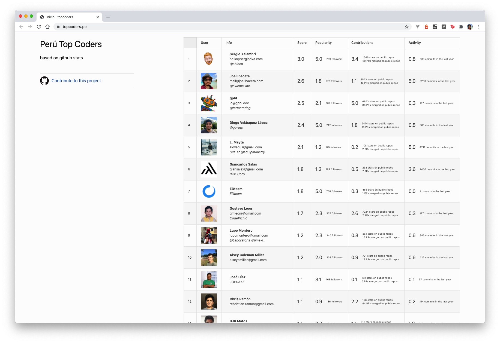

# Top Coders Perú
Based on Github Stats

 

 

## ¿Cómo se calcula el Raking?

Para generar el ranking se realiza un calculo del indice rockstar, considerando las siguientes variables:

- Popularidad (_Número de seguidores_) 
- Impacto (_Número de estrellas en repositorios propios_)
- Actividad (_Número de commits en el ultimo año_)
- OpenSource (_Numero de proyectos personales publicos_) 

El indice de cada una de estas variables se divide entre el maximo general encontrado para cada variable, esto permitira obtener un indice relativo al total de la muestra.

 

 

## ¿Cómo funciona?

La pagina esta basada en Jekyll para la generacion de contenido estatico y de Travis CI para la generacion automatica de nuevos deploys cada dia, manteniendo actualizada la información del ranking.

## ¿Como Contribuir?

1. Crear un issue con la descripcion de la contribucion 
2. Hacer un fork del proyecto
3. Hacer los cambios y enviar un Pull Request

### Para iniciar el proyecto localmente necesitas 

- Ejecutar `bundle install`
- Ejecutar `jekyll build`
- Podras ver el sitio web generado en la carpeta `_site`
- Definir las siguientes variables de entorno: `CLIENT_ID` y `CLIENT_SECRET` puedes obtener tus credenciales de la siguiente manera https://developer.github.com/v3/guides/basics-of-authentication/

